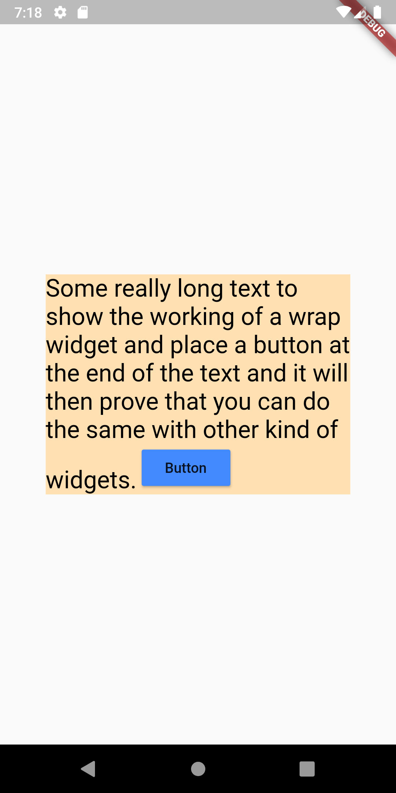

# Test App

The task was to include a widget right where the text line ends after rendering, so the solution here in this branch is by using a ```RichText``` and then using the ```TextSpan``` and ```WidgetSpan``` inside the children property of the parent widget. The result achieved was as follows:</br>
<p align="center"></p>

## Getting Started

This project contains the code for the features that I need to add to my project, so what I do is I try those features seperately on a test app and then I write them to my main project.

## Cloning and running the code
The branches are named according to the feature I have tried in that branch so whatever you want to look at, just checkout to that branch and take a look at THE code.

Suggestions are always welcome for improvements to this repository.
